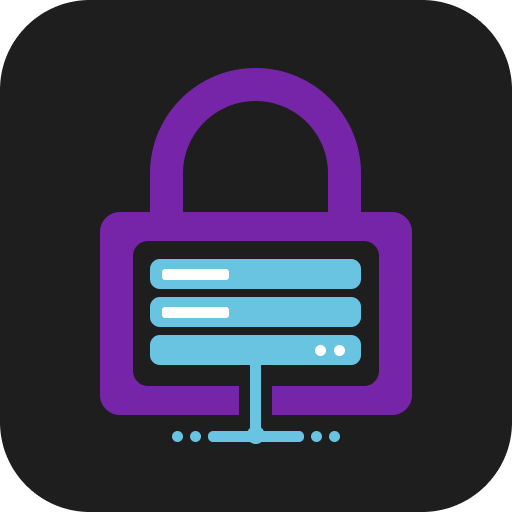
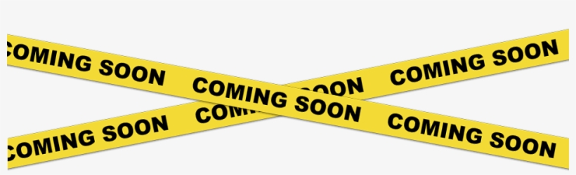

<!-- Logo -->
<p align="center">
  <a href="https://github.com/StandartCoder/DiMoPa">
    
  </a>
</p>

<!-- Title -->
<h1 align="center">Discord Moderation Panel</h1>
  <p align="center">
    Discord Moderation Panel that allows you to manage your discord server!
    <br />
    <br />
    <a href="https://github.com/StandartCoder/DiMoPa/issues/new?assignees=&labels=Bug&template=bug_report.md&title=%5BBUG%5D">Report Bug</a>
    ·
    <a href="https://github.com/StandartCoder/DiMoPa/issues/new?assignees=&labels=Suggestions&template=suggestions.md&title=%5BSUGGESTION%5D">Request Feature</a>
  </p>
</h1>
<br/><br/>

<!-- Preview -->
<p align="center">
  <a href="">
    
  </a>
  <!-- Drop Shadow -->
  <a href="">
    
  </a>
</p>
<br/>

<!-- Information -->
## What's DiscordModerationPanel?

<a href="https://github.com/StandartCoder/DiMoPa" target="_blank">DMP</a> is a new panel that allows you to manage your discord server using an web panel.
<br/>

<!-- Features -->
## ✨ Features

- 📊 **Discord Bot Statistics:** Gain full insights and details of your discord bot with server and bot information.
- 💬 **Simple Managing Interface:** DMP allows you to easily manage members/messages within servers using your discord bot. The panel also has a light and dark theme to suit your needs!
- 🔒 **Security:** DMP does not run on any servers and can be self-hosted. All bot details are stored locally and is completely secure.
- 👀 **Open Source:** DMP is open source on GitHub so you can see all the code behind the project.

<br/>

<!-- Getting Started -->
## 🛠 Getting Started

Simply double-click the start file to launch the panel, if you are using an Unix/Linux just use `.\start.sh`.
<br/>

<!-- Installation -->
### **Step 1:** Prerequisites
To use the **application**, you will need to have the following installed.

- Node.js
- npm

[Instructions](https://docs.npmjs.com/downloading-and-installing-node-js-and-npm)

### **Step 2:** Setup / Installation

1. Clone the repository

```sh
git clone https://github.com/StandartCoder/DiMoPa
cd DiMoPa/
```

> ⚠️ **NOTE**: Coming Soon... Don't do it now...
2. Just double-click the start file and the panel start... But now the panel isn't set up yet.
3. Once you launch it the first time you can setup the panel, and this is pretty easy!
4. Start using DMP!
<br/>

<!-- ROADMAP -->
## Roadmap

<p align="center">
  <a href="">
    
  </a>
  <!-- Drop Shadow -->
  <a href="">
    
  </a>
</p>

<!-- CONTRIBUTING -->
## Contributing

Contributions are what make the open-source community such an amazing place to learn, inspire, and create. Any contributions you make are **greatly appreciated**.

View [translation guide](https://github.com/StandartCoder/DiMoPa/blob/main/.github/TRANSLATION.md). 
> ⚠️ **NOTE**: Not active currently...

View [contribution guide](https://github.com/StandartCoder/DiMoPa/blob/main/.github/CONTRIBUTION.md).
<br/>
<br/>

## Supporters/Contributors
### Translators:

| Author                                                | Language  |
| ----------------------------------------------------- | --------- |
| [StandartCoder](https://github.com/StandartCoder)     | English   |
| [StandartCoder](https://github.com/StandartCoder)     | German    |

<br/>

## License

Copyright © 2023 StandartCoder (standartcoder@gmail.com)

Distributed under the GNU General Public License v3.0. See `LICENSE` for more information.
